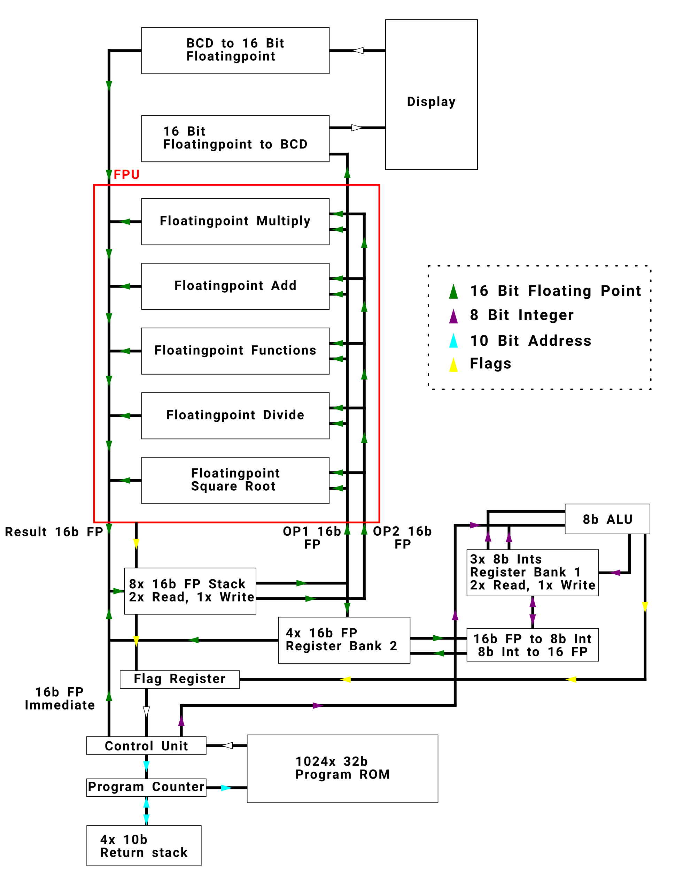

# Scientific Calculator in Minecraft

This document describes some architectural decisions I made as well as concepts I implemented in my Scientific
Calculator I built in Minecraft. I built this Calculator back in 2016/17 when I was 15 and published a video of it on
YouTube on May 1st 2017. It's a nice and short summary and can be viewed
here: https://www.youtube.com/watch?v=3Gtik9eMeMU&feature=emb_logo

The calculator is capable of doing following operations:

* Add, Subtract
* Multiply, Divide
* Power Of, Square root
* Natural logarithm, Base 10 logarithm
* Exponential Function, root to base N
* sine, cosine and tangent

It operates on real numbers and has a precision of 3 digits. The largest absolute number representable is 65504 and the
smallest around 0.00006. Add, Subtract, Multiple, Divide and Square root are simple operations that take around 2
minutes to finish. Other operations take roughly 30 to 50 minute to finish. All input and output is done using
Scientific notation.

## Block Diagram

The whole Calculator can be split into three parts.

The largest and most important component is the FPU. It operates on IEEE 754 Half Precision Floating Point Numbers and
supports operations such as multiply, divide, add, subtract, square root and miscellaneous math functions like absolute.
Instead of using registers, the FPU operates on a stack of eight numbers.

The ALU is a simple 8 bit ALU that has two register banks with registers R1 to R7 to work with. R0 is always the
constant 0. The ALUs main job in the calculator is implementing control flow like loops.

Last is the Control Unit. It is responsible for taking in the 32 bit machine code, decoding it and then signaling all
components what to do. This includes what operations the FPU and ALU should be doing, which registers and stack slots
should be read or written to as well as controlling the program counter and return stack.

The whole CPU is single stage. During a single clock cycle the operand is decoded, memory read, operations performed and
then written back into memory. A single clock cycle takes 30s resulting in a frequency of 33.3 mHz. The ISA is 32 bit
and capable of addressing both the FPU and ALU at the same time, allowing them to operate in parallel.

## Redstone basics

Redstone in Minecraft is a type of block able to carry digital. It can be turned on and off in an instance and has a
range of 15 blocks. After 15 blocks a so-called repeater must be placed to replenish the signal strength. A repeater
also adds a delay of 0.1 seconds to the signal. For Redstone to be turing complete a so called Redstone torch is used as
an inverter. It is turned on by default and if the block the torch is placed on is powered by a Redstone signal the
torch turns off. Therefore, all digital circuits can be implemented in Minecraft. A torch acts as an inverter,
connecting two Redstone signals acts as an OR gate and using NOR Logic we can then implement an AND gate too.

## Memory architecture

Four different blocks of memory exist in the calculator.

The FPU operates on a stack of eight values that are all stored in 16 bit floating-point format. The instructions as
well as the stack architecture have largely been copied from the Intel 8087 Co processor. The first value in the stack
called ST0 is the slot that new values are pushed onto or popped from. When doing an operation with the FPU, ST0 is
always one of the two operands or the only one. Results are either written to ST0 or the other operand depending on the
instruction. Instructions may also pop or push the stack.

The ALU operates on 7 registers R1 to R7. The instructions for the ALU are all three operand instructions. One is
therefore capable of choosing both operand registers, and the destination register. Registers R1 and R3 are actual 8 bit
registers. R4 to R7 are in reality 16 bit registers that store their values as 16 bit floating-point numbers. When read
from or written to from the ALU conversion to 8-bit integer happens automatically. These 4 registers are also able to be
read from or written to from the FPU and allows for interoperability between the two.

The largest block of memory is the ROM. It contains 1024 lines of 32 bit instructions where the whole calculator program
is encoded into as machine code. It gets the address that should be read from directly from the program counter.

Inside the control unit there is also a program stack that can contain up to 4 addresses. It is used to jump into
subprograms and be able to return from them.

## Instruction set architecture

The instruction set is 32 bits can capable of addressing FPU and ALU in parallel. It has 4 different layouts dependent
on the OP codes specified for both FPU and ALU.

### FPU Opcodes

The FPU OP Code is 5 bit allowing for a maximum of 32 operations. Unless the FI layout is used the next 3 bits STn is
the other operand of an operation. Operations may also push or pop values from the stack.

If the bit after STn is set, the roles of ST0 and STn are switched. As an example: If the FADDP OP Code is encountered
ST1 is specified in the STn field, and the bit is set then STn + ST0 is computed, the result stored into STn and then
the stack popped. Without the bit set, ST0 + STn would be computed, stored into ST0 and ST0 popped (which would be
nonsensical). In Mnemonic the former would be written as `FADDP ST1;ST0`, the latter as `FADDP ST0;ST1`, roughly
mirroring a 2 register operation scheme from ISAs like x86.

Following FPU OP Codes exist:

| Assembly name | OP-Code in binary | Description        | ISA Layout used if applicable |
| ------------- | ----------------- | ------------------ | ----------------------------- |
| FWAIT         | 00000             | No-op              | N/A                           |
| FADD          | 00001             | ST0 = ST0 + STn          | N/A                           |
| FADDP         | 00010             | ST0 = ST0 + STn, Pops    | N/A                           |
| FSUB          | 00011             | ST0 = ST0 - STn          | N/A                           |
| FSUBP         | 00100             | ST0 = ST0 - STn, Pops    | N/A                           |
| FSUBR         | 00101             | STn = ST0 - STn   | N/A                           |
| FSUBRP        | 00110             | STn = ST0 - STn, Pops   | N/A                           |
| FMUL          | 00111             | ST0 = ST0 * STn          | N/A                           |
| FMULP         | 01000             | ST0 = ST0 * STn, Pops    | N/A                           |
| FDIV          | 01001             | ST0 = ST0 / STn          | N/A                           |
| FDIVP         | 01010             | ST0 = ST0 / STn, Pops    | N/A                           |
| FDIVR         | 01011             | STn = ST0 / STn,    | N/A                   |
| FDIVRP        | 01100             | STn = ST0 / STn, Pops    | N/A                   |
| FSQRT         | 01101             | ST0 = sqrt(ST0) | N/A                           |
| FABS          | 01110             | ST0 = abs(ST0)    | N/A                           |
| FSCALE        | 01111             | ST0 = 1 << int(STO)  | N/A                           |
| FEXP          | 10000             | ST0 = Floating point exponent of ST0  | N/A                           |
| FMANT         | 10001             | ST0 = Floating point mantissa of ST0  | N/A                           |
| FINT          | 10010             | ST0 = int(ST0)  | N/A                           |
| FCOM          | 10011             | ST0 = ST0 - int(ST0)| N/A                           |
| FEXM          | 10100             | Sets flags for ST0 | N/A                           |
| FLOAD         | 10101             | Push value from Rn | N/A                           |
| FSTORE        | 10110             | Pop ST0 into Rn    | N/A                           |
| FCLOAD        | 10111             | Pushes math constant Cn | N/A                           |
| FILOAD        | 11000             | Pushes immediate value | FI                           |
| FBLD          | 11001             | Pushes number N from display | N/A                           |
| FBSTP         | 11010             | Pop ST0 to display | N/A                           |

The `FCLOAD` instruction pushes a common math constant onto the FPU stack. Depending on the STn field, following math
constants are loaded:

| STn Value | Constant |
| --------|----------|
| 0       | 0        |
| 1       | 1        |
| 2       | Pi       |
| 3       | ln of 10 |
| 4       | log2 of e|
| 5       | log10 of 2|
| 6       | ln of 2  |
| 7       | e        |

### ALU Opcodes

Depending on the ALU instruction one of the three layouts RRR, RRI or JA are used. Most instructions use the RRR layout.
It's a RISC typical 3 register instruction layouts which saves into first specified destination register and uses the
latter 2 registers as left and right operands. The RRI layout is used with instructions that use a constant as the
second operand. For both conditional and unconditional branches the JA layout is used to specify the target address.

Following ALU Opcodes exist:

| Assembly name | OP-Code in binary | Description        | ISA Layout used if applicable |
| ------------- | ----------------- | ------------------ | ----------------------------- |
| WAIT          | 000000            | No-op              | N/A                           |
| ADD           | 000001            | Des = OP1 + OP2    | RRR                           |
| ADC           | 000010            | Des = OP1 + OP2 + 1| RRR                           |
| SUB           | 000011            | Des = OP1 - OP2    | RRR                           |
| SBC           | 000100            | Des = OP1 - OP2 - 1| RRR                           |
| OR            | 000101            | Des = OP1 OR OP2   | RRR                           |
| AND           | 000110            | Des = OP1 AND OP2  | RRR                           |
| XOR           | 000111            | Des = OP1 XOR OP2  | RRR                           |
| NOT           | 001000            | Des = NOT OP1      | RRR                           |
| SHR           | 001001            | Des = OP1 /2       | RRR                           |
| SHL           | 001010            | Des = OP1 * 2      | RRR                           |
| ADDI          | 001011            | Des = OP1 + I      | RRI                           |
| ANDI          | 001100            | Des = OP1 AND I    | RRI                           |
| BEQ           | 001101            | Jump if EQ set     | JA                            |
| BNE           | 001110            | Jump if EQ not set | JA                            |
| BMI           | 001111            | Jump if N set      | JA                            |
| BPL           | 010000            | Jump if N not  set | JA                            |
| BCS           | 010001            | Jump if C set      | JA                            |
| BCC           | 010010            | Jump if C not set  | JA                            |
| BLO           | 010011            | Jump if L set      | JA                            |
| BLS           | 010100            | Jump if L or EQ set| JA                            |
| BHS           | 010101            | Jump if H or EQ set| JA                            |
| BHI           | 010110            | Jump if H set      | JA                            |
| BLT           | 010110            | Jump if LE set     | JA                            |
| BLE           | 010111            | Jump if LE or EQ set| JA                            |
| BGE           | 011000            | Jump if G or EQ set| JA                            |
| BGT           | 011001            | Jump if G set      | JA                            |
| FBEZ          | 011011            | Jump if F0 set     | JA                            |
| FBNZ          | 011100            | Jump if F0 not set | JA                            |
| FBMI          | 011101            | Jump if FN set     | JA                            |
| FBPL          | 011110            | Jump if FN not set | JA                            |
| JMP           | 011111            | Unconditional Jump | JA                            |
| JALS          | 100000            | Jump and push current Program Counter + 1 to Address Stack | JA                           |
| RET           | 100001            | Jump to the top address on the address stack and pop it off the stack | N/A                            |
| END           | 100010            | Set Program counter to 0 and halt | N/A                            |

### Flags

All conditional branches jump depend on if a specific flag in the flag register is set. The values in the flag 
register are updated when the very last bit in the machine code is set. It will then examine the outputs and inputs of
both the ALU and the FPU for that specific instruction and update all flags in the flag register accordingly.

Following flags are available:

| Flag | Condition |
| ---- | --------- |
| EQ   | OP1 == OP2|
| N    | ALU Result is negative |
| C    | Carry Overflow in the ALU |
| L    | unsigned OP1 < OP2 |
| H    | unsigned OP1 > OP2 |
| LE   | signed OP1 < OP2 |
| G    | signed OP1 > OP2 |
| F0   | FPU Result is 0  |
| FN   | FPU Result is negative |

OP1 and OP2 are either the two source registers or a register and the constant in the RRI layout.

